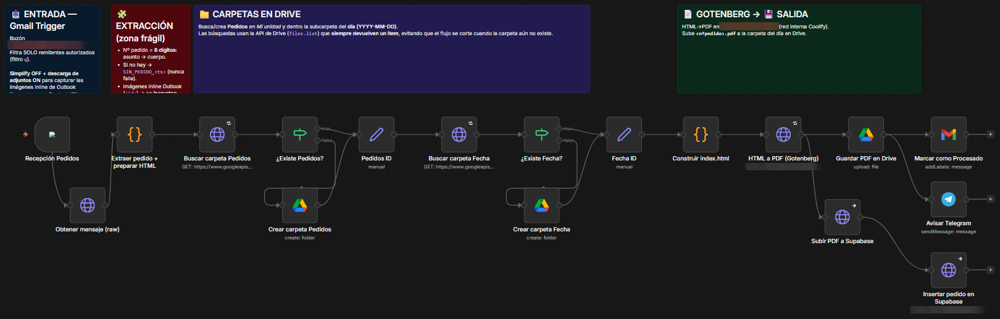
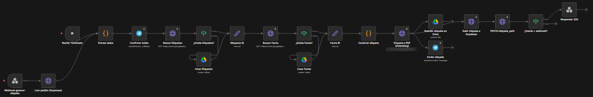
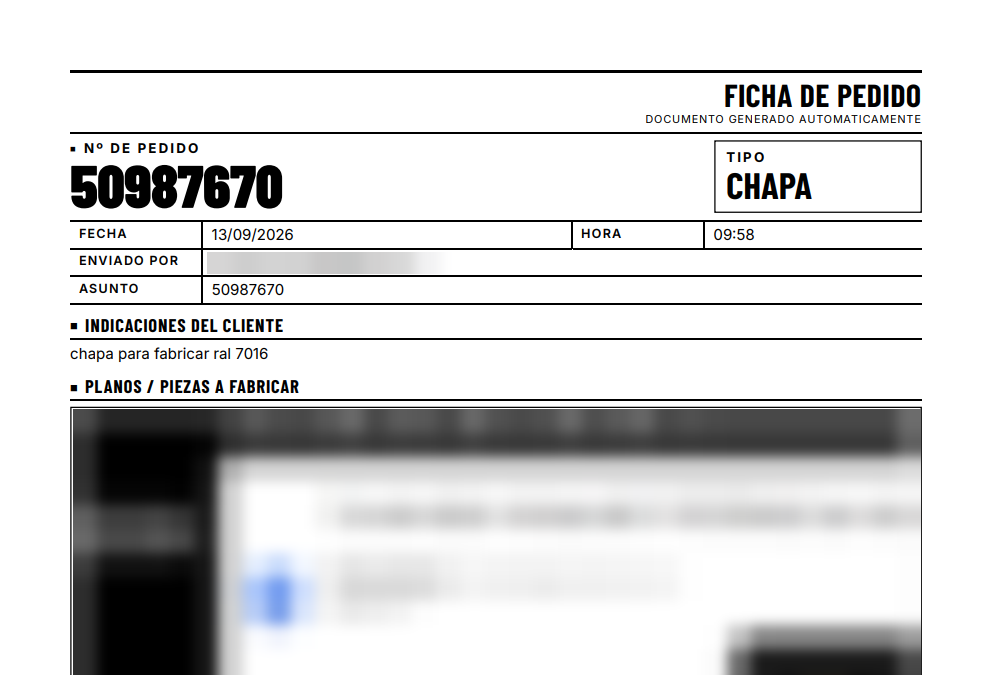
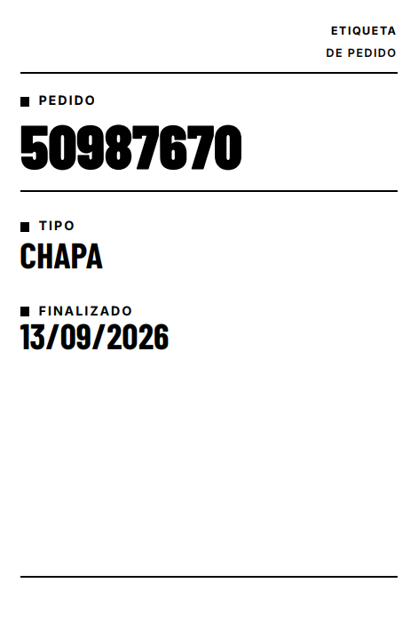

# n8n Order Automation · Automatización de pedidos

Dos flujos de n8n en producción que llevan cada pedido de un taller de chapa desde el correo del cliente hasta el taller, sin registro manual.

> El flujo de pedidos está exportado, sin datos sensibles, en [`sample/`](sample/). Demo disponible bajo petición.

## 1 · Pedidos: del correo al PDF

- Lee los correos de pedidos, solo de remitentes autorizados.
- Extrae el número de pedido y los planos adjuntos.
- Genera la **ficha de pedido en PDF** y la guarda en Google Drive, en carpetas por fecha que crea si no existen.
- Registra el pedido en el panel del taller y avisa por **Telegram**.

## 2 · Etiqueta de pedido terminado

- Se lanza al confirmar el pedido desde Telegram o desde el panel del taller.
- Genera la **etiqueta en PDF**, la guarda en Drive, la envía por Telegram y la enlaza al pedido.

<table><tr>
<td width="68%"></td>
<td width="32%"></td>
</tr></table>

Documentos generados por los flujos. Los datos del cliente aparecen difuminados.

## Cómo está hecho

| | |
|---|---|
| **Automatización** | n8n autoalojado |
| **Integraciones** | Gmail · Google Drive · Telegram · API REST de la base de datos |
| **Documentos** | Plantillas HTML convertidas a PDF con Gotenberg |
| **Infraestructura** | Docker en servidor propio |

## Mi papel

Análisis del proceso con el taller, diseño de los flujos y las plantillas, puesta en producción y mantenimiento.

---

[Perfil](https://github.com/miquel-moreno) · [LinkedIn](https://www.linkedin.com/in/miquel-moreno-martinez)
